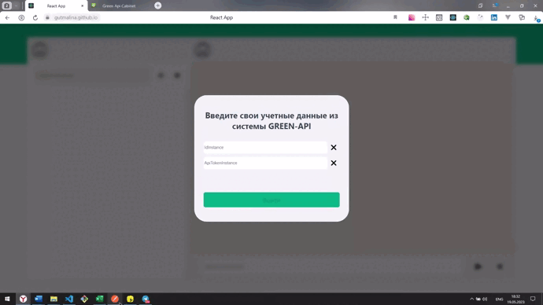

# Тестовое задание на вакансию Фронтенд разработчик React (Грин-Апи)

~~~~~~~~~~

~~~~~~~~~~

### Стэк:
* CSS, Flexbox, Grid Layout
* HTML
* JavaScript
* React, React Hooks
* API

### Задание:
В рамках тестового задания требуется разработать пользовательский интерфейс для
отправки и получений сообщений WhatsApp

* Требуется разработать пользовательский интерфейс для отправки и получений
сообщений WhatsApp
* Требуется использовать сервис GREEN-API https://green-api.com/
* Требуется реализовать отправку и получение только текстовых сообщений
* Требуется за прототип интерфейса взять внешний вид чата
https://web.whatsapp.com/
* Требуется реализовать интерфейс максимально простым с минимальным набором
функций

* Требуется отправку сообщений реализовать методом https://green-
api.com/docs/api/sending/SendMessage/

* Требуется получение сообщений реализовать методом https://green-
api.com/docs/api/receiving/technology-http-api/

* Требуется использовать технологию React
Ожидаемый результат:
• Пользователь переходит на сайт чата и вводит свои учетные данные из
системы GREEN-API (idInstance, apiTokenInstance)
• Пользователь вводит номер телефона получателя и создает новый чат
• Пользователь пишет текстовое сообщение и отправляет его получателю в
WhatsApp
• Получатель отвечает на сообщение в мессенджере WhatsApp
• Пользователь видит ответ получателя в чате

### Установка локальной версии
* Скопируйте ссылку https://github.com/gutmalina/green-api.git
* Склонируйте репозиторий git clone https://github.com/gutmalina/green-api.git
* Запустите команду npm install, или npm install react-script --save
* Запустите команду npm start

### Ссылки:
* :mag_right: [Открыть проект](https://gutmalina.github.io/green-api/)
